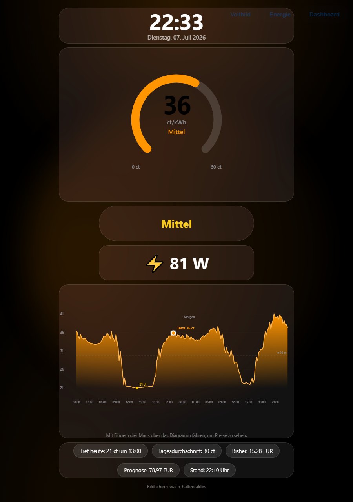
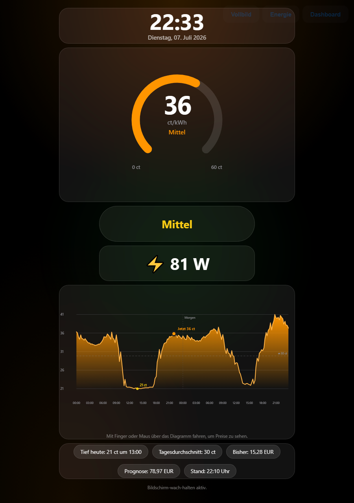
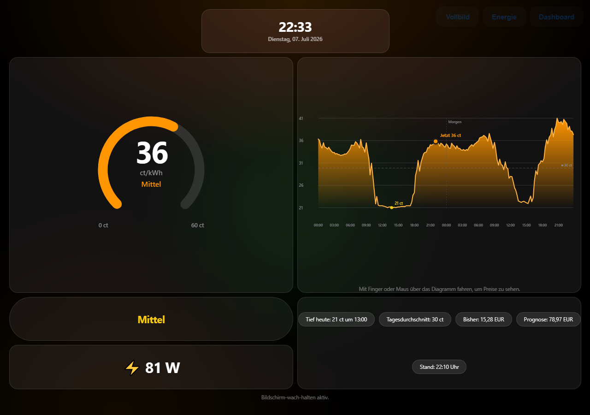
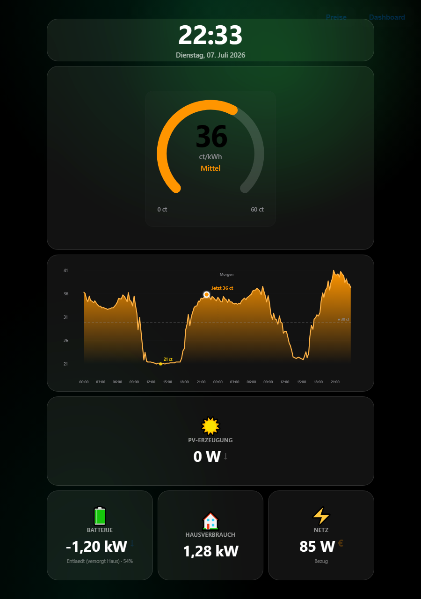
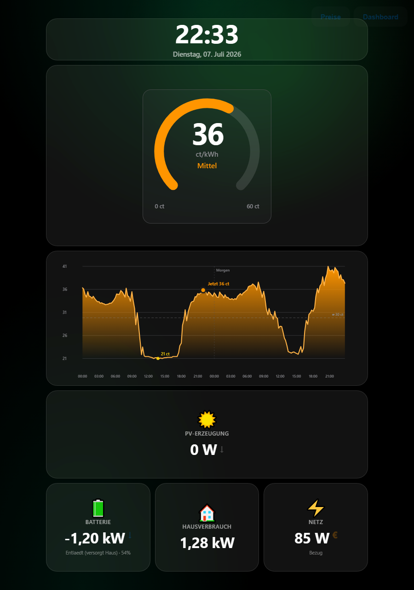
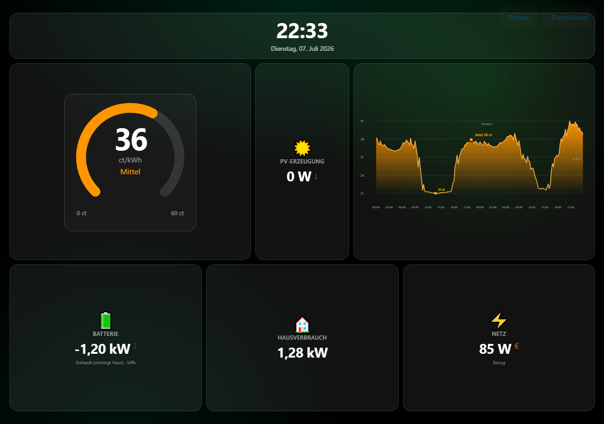

# Dynamic Price Clock

ESP32-C5-Firmware für ein Strompreis-Display mit zwei runden GC9A01-Bildschirmen, WS2812B-LED-Tagesring und optionaler MAX7219-Matrix. Web-Dashboard mit Drag-and-Drop-Layout-Editor, Hell/Dunkel-Modus, zwei Tablet-/TV-Kiosk-Ansichten (Preise + Energiefluss), Live-Verbrauch über Tibber Pulse, optionale Anker-Solarbank-Anbindung (PV-Erzeugung/Batterie/Netzbezug), Monatskosten-Tracking mit Prognose sowie GitHub-OTA- und manuelle Firmware-Uploads. Strompreise wahlweise über **Tibber** oder **aWATTar** (Deutschland/Österreich, ohne Anmeldung).

## Strompreis-Quelle

Im Web-Dashboard unter **Konto → Strompreis-Quelle** wählbar:

- **Tibber** – benötigt einen Zugangstoken (siehe Abschnitt darunter auf der Konto-Seite), liefert bereits den fertigen Endkundenpreis inkl. Netzentgelten/Steuern.
- **aWATTar Deutschland / Österreich** – frei nutzbar ohne Anmeldung, liefert aber nur den reinen Börsenpreis (day-ahead, stündlich). Netzentgelte/Steuern lassen sich als fixer Aufschlag (ct/kWh) und Mehrwertsteuersatz (%) ergänzen: `Endpreis = (Börsenpreis/1000 + Aufschlag/100) × (1 + MwSt/100) EUR/kWh`.

## Fertiges Gerät

> **Bekannter Defekt:** Das obere Display (Display 1, Preisverlauf-Ansicht) hat einen Hardware-Defekt und zeigt Bildfehler/Verzerrungen. Display 2 (unten, Preis-Uhr) funktioniert einwandfrei.

Benötigte Teile für den Nachbau: siehe [BOM.md](BOM.md) (Stückliste). Verkabelung: siehe [WIRING.md](WIRING.md) (Verdrahtungsplan).

## Web-Dashboard

| Übersicht | Layout Editor |
|---|---|
|  |  |

| Konto | WLAN |
|---|---|
|  |  |

| Pinout | Displays |
|---|---|
|  |  |

| Tagesring | Matrix |
|---|---|
|  |  |

Jede Seite gibt es auch im Dunkelmodus (`docs/screenshots/*-dark.png`).

### Tablet-/Kiosk-Modus

Es gibt zwei eigene Vollbild-Ansichten für ein dauerhaft angeschlossenes Tablet, Handy, Desktop oder TV, beide mit Wake Lock (kein Standby), Skalierung bis 4K und automatischem zweispaltigem Layout im Querformat:

- **`/kiosk` – Preise:** großes Preis-Gauge, interaktives Diagramm (Fahren mit Finger/Maus zeigt Preise per Fadenkreuz), aktueller Live-Verbrauch (per Tibber Pulse, ab 1200 W als kW-Wert), Monatskosten mit Prognose fürs Monatsende.
- **`/kiosk2` – Energiefluss:** dieselbe Preis-Gauge + dasselbe Diagramm, dazu PV-Erzeugung, Batterie (inkl. Restkapazität in %), Hausverbrauch und Netzbezug/-einspeisung (mit animiertem €-Symbol) – basierend auf der optionalen Anker-Solarbank-Anbindung (siehe unten). Ohne hinterlegte Anker-Zugangsdaten bleiben PV/Batterie/Netz leer, Preis-Gauge und Diagramm funktionieren unabhängig davon.

Beide Seiten verlinken sich gegenseitig oben rechts. Die Widget-Positionen lassen sich für **beide** Kiosk-Seiten getrennt nach Hoch-/Querformat im Layout-Editor per Drag-and-Drop anpassen (Seiten-Umschalter "Kiosk 1: Preise" / "Kiosk 2: Energie" oben im Editor).

| `/kiosk` Hochformat | `/kiosk` Hochformat (Dunkelmodus) |
|---|---|
|  |  |

| `/kiosk` Querformat (Dunkelmodus) |
|---|
|  |

| `/kiosk2` Hochformat | `/kiosk2` Hochformat (Dunkelmodus) |
|---|---|
|  |  |

| `/kiosk2` Querformat (Dunkelmodus) |
|---|
|  |

> Der Layout-Editor (Screenshot oben) hat einen Seiten-Umschalter oben ("Kiosk 1: Preise" / "Kiosk 2: Energie"), mit dem sich beide Kiosk-Seiten getrennt anpassen lassen.

## Anker Solarbank (optional)

Unter **Konto → Anker Solarbank** lassen sich die Zugangsdaten deines Anker-Kontos hinterlegen, um PV-Erzeugung, Batterieleistung/-ladezustand und Hausverbrauch auf der Energiefluss-Kiosk-Seite (`/kiosk2`) anzuzeigen. Es handelt sich um eine **inoffizielle, reverse-engineerte Cloud-API** (kein offizieller Anker-Support) – Anker kann sie jederzeit ändern, ein Ausfall der Anbindung betrifft nur `/kiosk2`, nicht die übrige Firmware. Login erfolgt verschlüsselt (ECDH/AES-256) direkt gegen die Anker-Cloud, es werden keine Zugangsdaten an Dritte übertragen. Die Konto-Seite zeigt bei Verbindungsproblemen die rohe API-Antwort zur Fehlersuche an (aufklappbar).

## Einrichtung (Arduino IDE)

**Board:** ESP32C5 Dev Module (Board-Paket `esp32:esp32`, Boards-Manager-URL `https://raw.githubusercontent.com/espressif/arduino-esp32/gh-pages/package_esp32_index.json`)

**Werkzeuge → Partition Scheme:** **"No FS 4MB (2MB APP x2)"**
Das Standardschema ("Default 4MB with spiffs") reicht nicht aus – der Sketch belegt aktuell ca. 1,75 MB Flash und braucht ein Schema mit größerer, aber weiterhin **echter 2-Slot-OTA-fähiger** App-Partition (~1,94 MB je Slot). Mit dem Standardschema schlägt der Build mit "Sketch is too large" fehl. Das früher empfohlene **"Huge APP (3MB No OTA)"**-Schema unbedingt vermeiden – wie der Name schon sagt, hat es nur einen einzigen App-Slot statt zweier, wodurch OTA-Updates die gerade laufende Partition überschreiben und strukturell unzuverlässig sind (das war lange Zeit die Ursache wiederkehrender Update-Fehler in diesem Projekt).

Falls das Gerät noch mit "Huge APP" oder einem anderen Ein-Slot-Schema geflasht ist: **einmalig** mit "No FS 4MB (2MB APP x2)" **und** aktiviertem "Erase All Flash Before Sketch Upload" per USB neu flashen (siehe Warnhinweis im nächsten Abschnitt), das Schema danach nicht mehr ändern.

**Benötigte Bibliotheken** (über den Bibliotheksverwalter installierbar):
- ArduinoJson
- Adafruit GFX Library
- Adafruit BusIO
- Adafruit GC9A01A
- Adafruit NeoPixel
- [WebSockets von Markus Sattler / Links2004](https://github.com/Links2004/arduinoWebSockets) (LGPL-2.1) – für den Tibber-Pulse-Live-Verbrauch

Nach dem Flashen läuft das Gerät beim ersten Start als WLAN-Access-Point ("Dynamic-Price-Clock-Setup", im Web-Dashboard unter **WLAN → Setup-Access-Point** änderbar) zur Erstkonfiguration.

### WLAN-Zugangsdaten, Tibber-Token, Anker-Login etc. bleiben beim Update erhalten

Alle gespeicherten Werte (WLAN-SSID/Passwort, Tibber-Token, Anker-Zugangsdaten, Strompreis-Einstellungen, Kiosk-Layouts, ...) liegen in einem eigenen NVS-Speicherbereich (`Preferences`), der von einem Firmware-Update **nicht** angefasst wird:

- **OTA-Update über den Button "Jetzt aktualisieren"** (Konto-Seite) **oder manueller `.bin`-Upload im Browser**: schreibt ausschließlich die neue Firmware in die aktuell inaktive App-Partition, rührt den Preferences-Speicher nicht an. Zugangsdaten bleiben garantiert erhalten – vorausgesetzt, das Gerät läuft bereits auf einem echten 2-Slot-OTA-Schema (siehe oben).
- **Manuelles Neuflashen per USB (Arduino IDE)**: bleibt ebenfalls erhalten, **solange** du
  1. **nicht** "Erase All Flash Before Sketch Upload" aktivierst, und
  2. **immer dasselbe Partition Scheme** verwendest ("No FS 4MB (2MB APP x2)", siehe oben) – ein Wechsel des Schemas verschiebt die Partitionstabelle und macht den Zugriff auf die alten NVS-Daten faktisch unmöglich, auch wenn sie physisch noch auf dem Chip liegen. Ein Partitionsschema kann grundsätzlich **nur** per USB-Neuflash geändert werden, niemals per OTA – ein einmaliger Wechsel (z.B. von einem alten Ein-Slot-Schema) erfordert also zwangsläufig, dass alle Einstellungen einmalig neu eingegeben werden.

## Setup-WLAN-Passwort

Für den Setup-Access-Point gibt es **kein festes Passwort im Code**. Jedes Gerät erzeugt beim ersten Start automatisch ein eigenes, zufälliges 10-stelliges Passwort und zeigt es an:
- auf dem Display (TFT 1), solange kein Heim-WLAN verbunden ist,
- in der seriellen Konsole (115200 Baud) beim Boot.

Das Passwort kann danach jederzeit im Web-Dashboard unter **Konto → Setup-WLAN-Passwort** geändert werden.

## Lizenz

Siehe [LICENSE](LICENSE) (GNU Affero General Public License v3.0).
