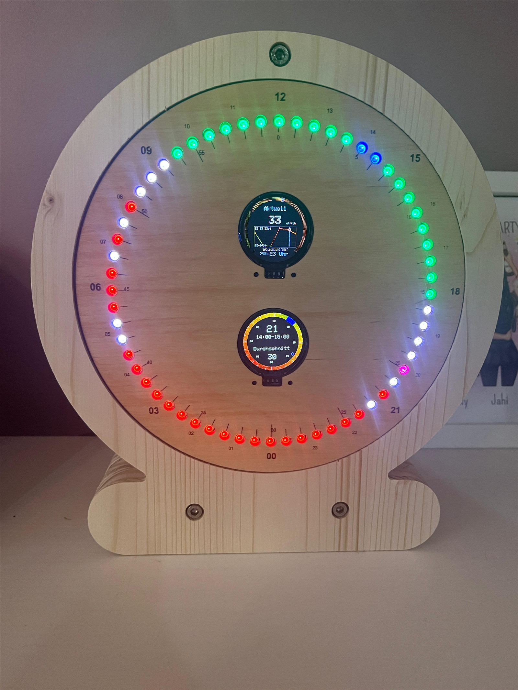
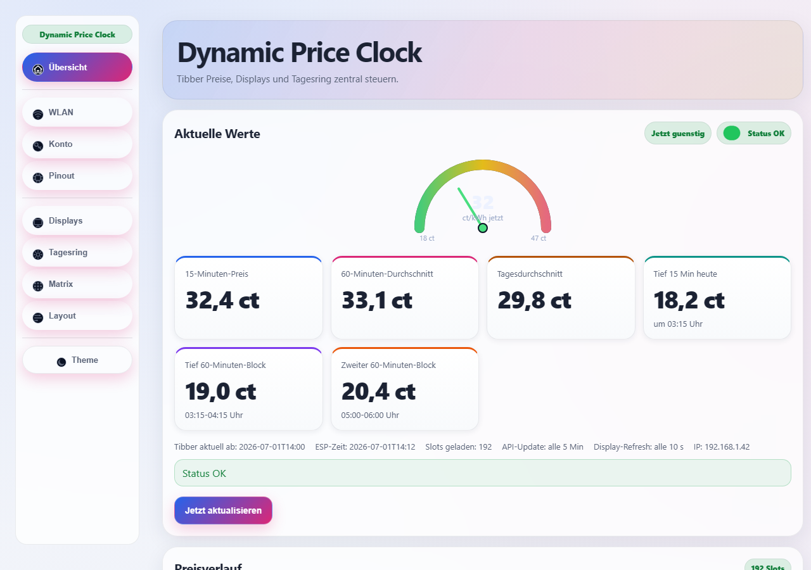
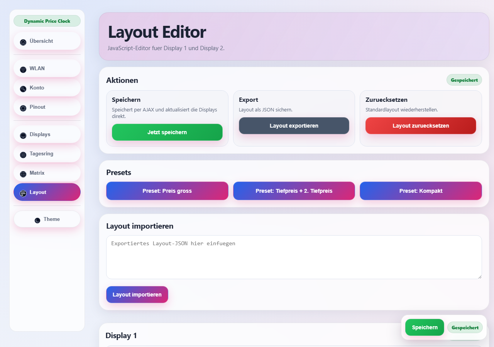
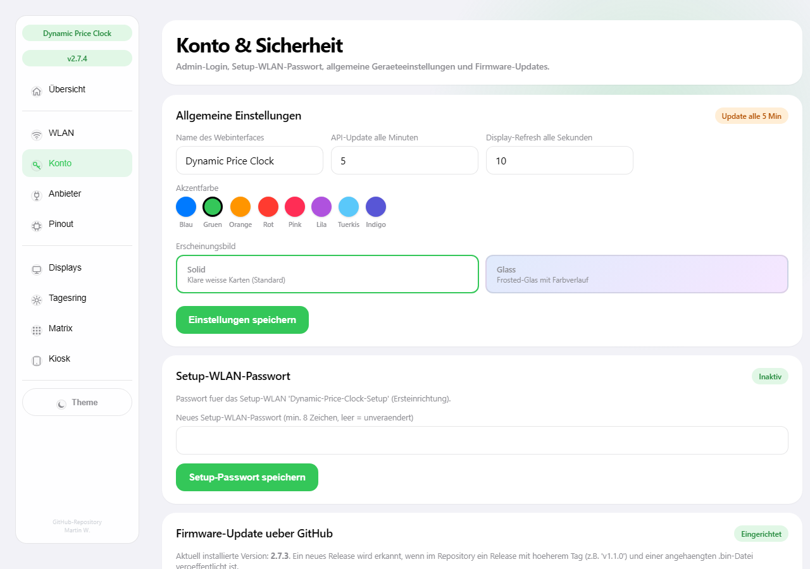
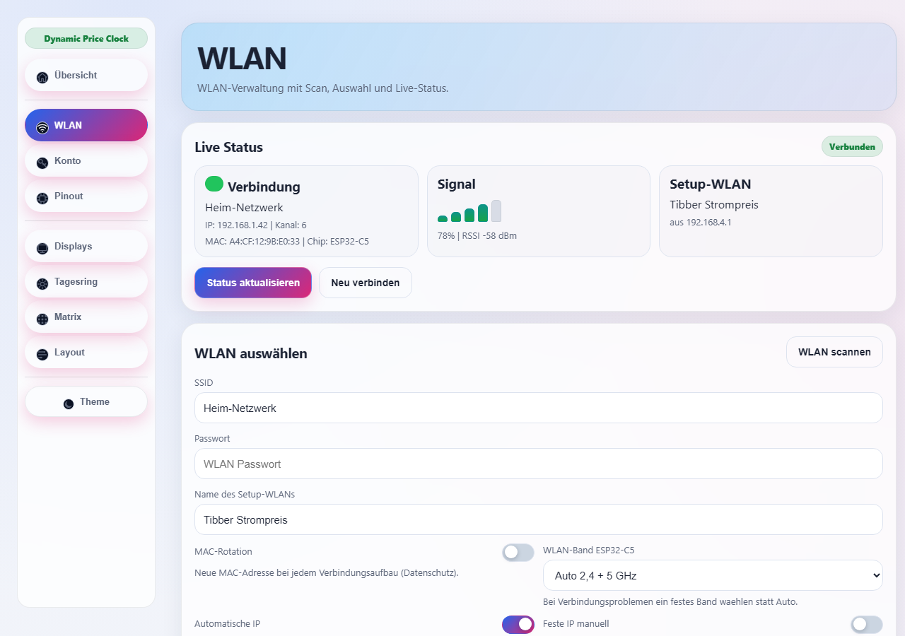
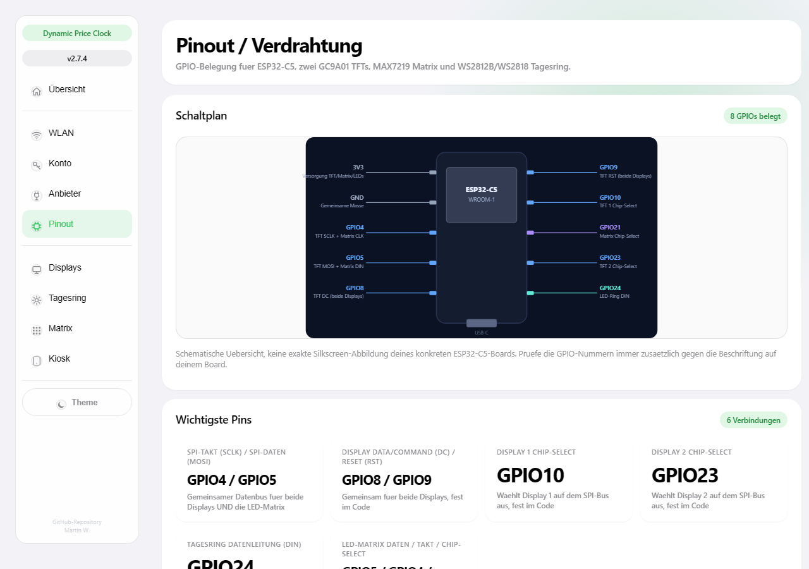
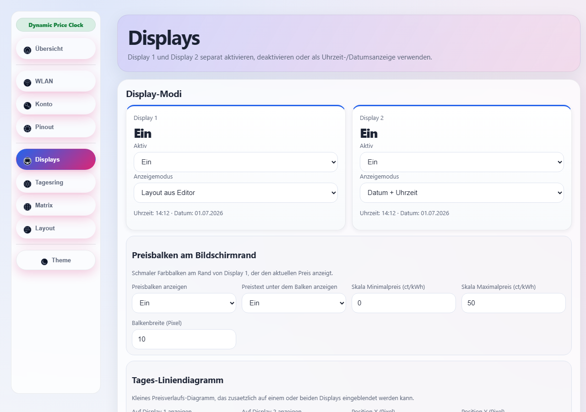
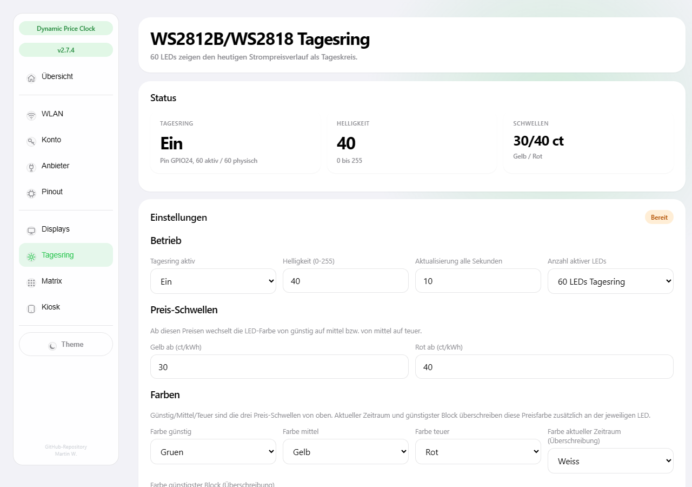
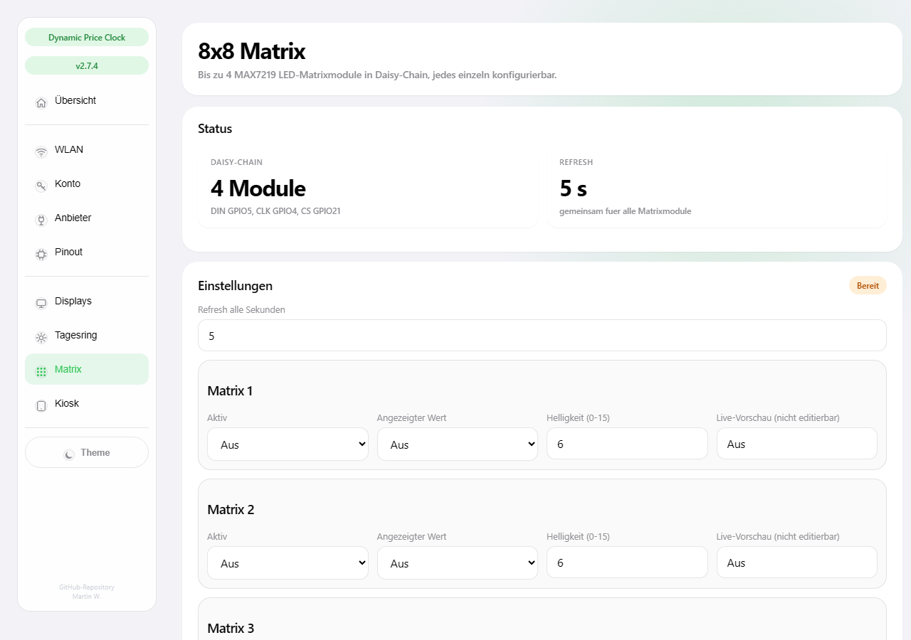

# Dynamic Price Clock

ESP32-C5-Firmware für ein Strompreis-Display mit zwei runden GC9A01-Bildschirmen, WS2812B-LED-Tagesring und optionaler MAX7219-Matrix – inkl. Web-Dashboard mit Layout-Editor, Hell/Dunkel-Modus und GitHub-OTA-Updates. Strompreise wahlweise über **Tibber** oder **aWATTar** (Deutschland/Österreich, ohne Anmeldung).

## Strompreis-Quelle

Im Web-Dashboard unter **Konto → Strompreis-Quelle** wählbar:

- **Tibber** – benötigt einen Zugangstoken (siehe Abschnitt darunter auf der Konto-Seite), liefert bereits den fertigen Endkundenpreis inkl. Netzentgelten/Steuern.
- **aWATTar Deutschland / Österreich** – frei nutzbar ohne Anmeldung, liefert aber nur den reinen Börsenpreis (day-ahead, stündlich). Netzentgelte/Steuern lassen sich als fixer Aufschlag (ct/kWh) und Mehrwertsteuersatz (%) ergänzen: `Endpreis = (Börsenpreis/1000 + Aufschlag/100) × (1 + MwSt/100) EUR/kWh`.

## Fertiges Gerät

> **Bekannter Defekt:** Das obere Display (Display 1, Preisverlauf-Ansicht) hat einen Hardware-Defekt und zeigt Bildfehler/Verzerrungen. Display 2 (unten, Preis-Uhr) funktioniert einwandfrei.

Benötigte Teile für den Nachbau: siehe [BOM.md](BOM.md) (Stückliste). Verkabelung: siehe [WIRING.md](WIRING.md) (Verdrahtungsplan).

## Web-Dashboard

| Übersicht | Layout Editor |
|---|---|
|  |  |

| Konto | WLAN |
|---|---|
|  |  |

| Pinout | Displays |
|---|---|
|  |  |

| Tagesring | Matrix |
|---|---|
|  |  |

Jede Seite gibt es auch im Dunkelmodus (`docs/screenshots/*-dark.png`).

## Einrichtung (Arduino IDE)

**Board:** ESP32C5 Dev Module (Board-Paket `esp32:esp32`, Boards-Manager-URL `https://raw.githubusercontent.com/espressif/arduino-esp32/gh-pages/package_esp32_index.json`)

**Werkzeuge → Partition Scheme:** **"Minimal SPIFFS (1.9MB APP with OTA/128KB SPIFFS)"**
Das Standardschema ("Default 4MB with spiffs") reicht nicht aus – der Sketch belegt mit aktiviertem GitHub-OTA-Update ca. 1,5 MB Flash und braucht ein Schema mit größerer, aber weiterhin OTA-fähiger App-Partition. Mit dem Standardschema schlägt der Build mit "Sketch is too large" fehl.

**Benötigte Bibliotheken** (über den Bibliotheksverwalter installierbar):
- ArduinoJson
- Adafruit GFX Library
- Adafruit BusIO
- Adafruit GC9A01A
- Adafruit NeoPixel

Nach dem Flashen läuft das Gerät beim ersten Start als WLAN-Access-Point ("Dynamic-Price-Clock-Setup") zur Erstkonfiguration.

## Setup-WLAN-Passwort

Für den Setup-Access-Point gibt es **kein festes Passwort im Code**. Jedes Gerät erzeugt beim ersten Start automatisch ein eigenes, zufälliges 10-stelliges Passwort und zeigt es an:
- auf dem Display (TFT 1), solange kein Heim-WLAN verbunden ist,
- in der seriellen Konsole (115200 Baud) beim Boot.

Das Passwort kann danach jederzeit im Web-Dashboard unter **Konto → Setup-WLAN-Passwort** geändert werden.

## Lizenz

Siehe [LICENSE](LICENSE) (GNU Affero General Public License v3.0).
