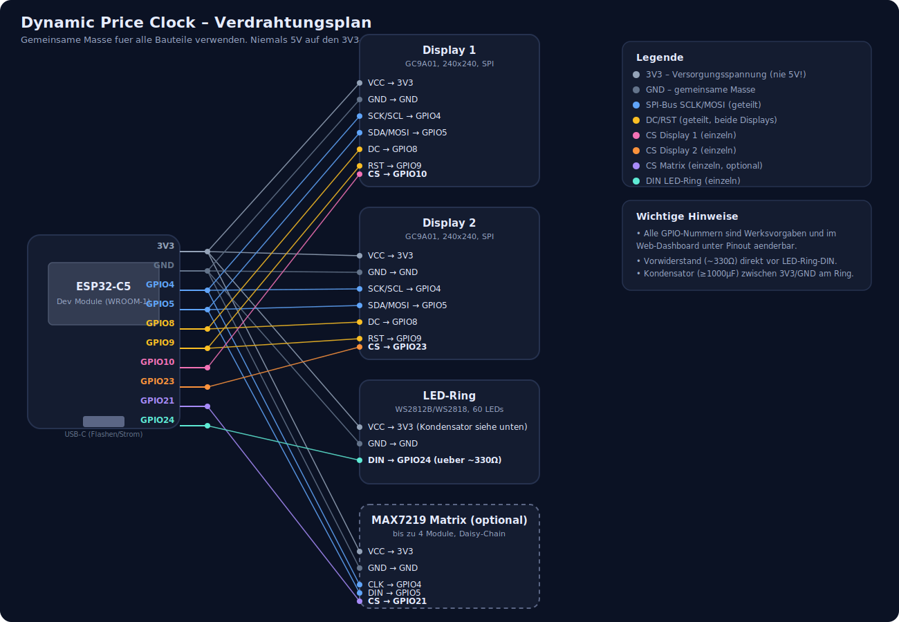

# Verdrahtungsplan

Alle Bauteile teilen sich Masse (GND) und Versorgungsspannung (3V3). **Niemals 5V auf den 3V3-Pin des ESP32-C5 geben.**

Die GPIO-Nummern sind Werksvorgaben aus der Firmware. Die vier mit "einzeln" markierten Chip-Select-Pins (Display 1, Display 2, Matrix) und der LED-Ring-Pin lassen sich nachträglich im Web-Dashboard unter **Pinout** per Dropdown ändern – SCLK, MOSI, DC und RST sind fest im Code verdrahtet und nicht per Web-Interface änderbar.

## Verbindungstabelle

### Display 1 (GC9A01, Preisverlauf)

| Display-Pin | ESP32-C5 | Hinweis |
|---|---|---|
| VCC | 3V3 | gemeinsam mit allen anderen Bauteilen |
| GND | GND | gemeinsame Masse |
| SCK / SCL | GPIO4 | geteilter SPI-Takt (auch Display 2 + Matrix) |
| SDA / MOSI | GPIO5 | geteilte SPI-Datenleitung (auch Display 2 + Matrix) |
| DC | GPIO8 | geteilt mit Display 2 |
| RST | GPIO9 | geteilt mit Display 2 |
| CS | GPIO10 | nur Display 1 |

### Display 2 (GC9A01, Preis-Uhr)

| Display-Pin | ESP32-C5 | Hinweis |
|---|---|---|
| VCC | 3V3 | |
| GND | GND | |
| SCK / SCL | GPIO4 | geteilt |
| SDA / MOSI | GPIO5 | geteilt |
| DC | GPIO8 | geteilt |
| RST | GPIO9 | geteilt |
| CS | GPIO23 | nur Display 2 |

### LED-Ring (WS2812B/WS2818, 60 LEDs)

| Ring-Pin | ESP32-C5 | Hinweis |
|---|---|---|
| VCC | 3V3 | Pufferkondensator ≥1000µF zwischen VCC und GND direkt am Ring |
| GND | GND | |
| DIN | GPIO24 | über einen Vorwiderstand (ca. 330 Ω) |

### MAX7219-Matrix (optional, bis zu 4 Module in Daisy-Chain)

| Matrix-Pin | ESP32-C5 | Hinweis |
|---|---|---|
| VCC | 3V3 | |
| GND | GND | |
| CLK | GPIO4 | geteilt mit beiden Displays |
| DIN | GPIO5 | geteilt mit beiden Displays |
| CS | GPIO21 | nur Matrix |

Nur relevant, wenn `ENABLE_MAX7219_MATRIX` in der Firmware aktiviert ist (siehe [dynamic-price-clock.ino](dynamic-price-clock.ino)).

## Reihenfolge beim Aufbau

1. Erst alle GND-Verbindungen aller Bauteile zusammenführen (Sternpunkt oder durchgehende Masseleitung).
2. Dann 3V3-Versorgung verkabeln, LED-Ring-Kondensator direkt an dessen VCC/GND anlöten.
3. SPI-Bus (SCLK/MOSI) an beide Displays (und ggf. Matrix) anschließen.
4. DC und RST an beide Displays anschließen.
5. Die drei individuellen Chip-Select-Leitungen (Display 1, Display 2, Matrix) sowie den LED-Ring-DIN zuletzt anschließen.
6. Vor dem ersten Einschalten alle Verbindungen gegen die Tabelle oben prüfen – ein vertauschter CS-Pin führt nur dazu, dass das falsche Display angesprochen wird, ein vertauschter 3V3/GND-Anschluss kann Bauteile beschädigen.
